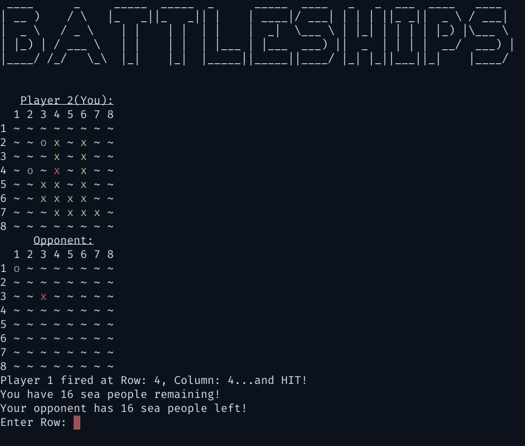

# Battleships-t2a2

Battleships is a CLI based game written in Python that can be played over a network. This application demonstrates development capabilities with networking, use of classes and object oriented programming.

## Screenshot:

## Features:
- Command line interface with a graphical representation of game boards
- Error handling through input sanitisation and program logic
- Multiplayer game wth networking functionality
- Automatic or manual ship placement

## Installation:

To download the source code of the application execute the following command at your command line prompt:
`git clone https://github.com/l-j-g/battleships-t2a2.git`

## Dependencies / Packages Used:
This program runs on Python. To install Python, check out https://installpython3.com/'

Before starting the application ensure that all of the system environment requirements have been met.

To install the necessary dependencies, navigate to your the root folder and execute the following command in your command line prompt:
`pip install -r requirements.txt`

*Battleships* requires the following Python packages to be installed:

- `random` : Python standard library, used to randomly generate numbers 
- `numpy` : external Python package, used to create an array and manipulate data that represents a battleships game board  
- `pdb` : Python standard library, used for debugging 
- `socket`: Python standard library, for networking and establishing connection between server and client. 
- `sys` : Python standard library, used to exit the program.
- `art` : external Python package, used to display game title.
- `traceback` : Python standard library, used to display debugging information upon error.
- `literal_eval` : from asl - Python standard library, used to evaluate strings communicated over network connection as a Python expression.
- `os` : Python standard library, used to evoke a function that will clear the terminal screen, regardless of users operating system.
- `ipaddress` : Python standard library, used to check if a string is a valid ip address.

## How to play:
Battleships is a two player game where each player places up to 5 ships of different lengths on a 9x9 grid.

Once all ships have been placed, players then take turn to guess the location of each others battleships one element at a time.  

When either player has guessed the location of all of the other players battleships the game is over.

To launch the game navigate the the installation direction and execute the following command: 

`python battleships.py`

### Input:

Input is taken from the user during three distinct processes:

- Setting up connection: port, address and role (client or server)
- Placement of ships: row and column 
- Co-ordinates of an attack: row and column

### Output:

Output to the user is provided by `draw()` function of the `Battleships` object. The draw function visually represents a `numpy` array of data according to the following legend:

| Logical           | Numerical | Visual    |
|-------------------|-----------|-----------|
|  An empty element | 0         | `~`       |
| A friendly ship   | 1         | green `x` |
| A damaged shit    | 2         | red `x`   |
| A missed attack   | 3         | blue `o`  |

### Error Handling:

This application implements error handling through input sanitisation and program logic.

Checking ensures that the input is of the correct type and that the inputs are logically correct in the context of the input (e.g. that the co-ordinates of a players turn are within the dimensions of the game board.)

Turn based control flow ensures two way communication is completed each turn before the game is progressed. During each turn one player will enter co-ordinates of their attack and send these co-ordinates to the other player. The application will check the co-ordinates of the attack and will respond to the player who sent the attack to indicate the result of the turn.

## Control Flow:

At a high level the control flow of the program can be described as follows: 

- initialise battleship class 
- initialise connection class as either server or client
- place ships on to the board
- while ships remain on both players boards, players take turns guessing the location of enemy ships.

The application control flow (excluding error checking for brevity) is detailed in the flowchart below.

The different processes of the program are colour coded as follows: 
- `green` : battleship class functions and variables, used to provide input and output to the user of the application.
- `blue` : placement of ships on the game board
- `yellow` networking class functions and variables, used for two-way communication between a server and a client.

## Classes:
`classes.py` utilises three different Python classes. 

- Battleship class: to represent one players game of Battleships
- Connection class: to establish a two-way connection required for a game of Battleships
- Format class : to represent ASCI escape codes 
